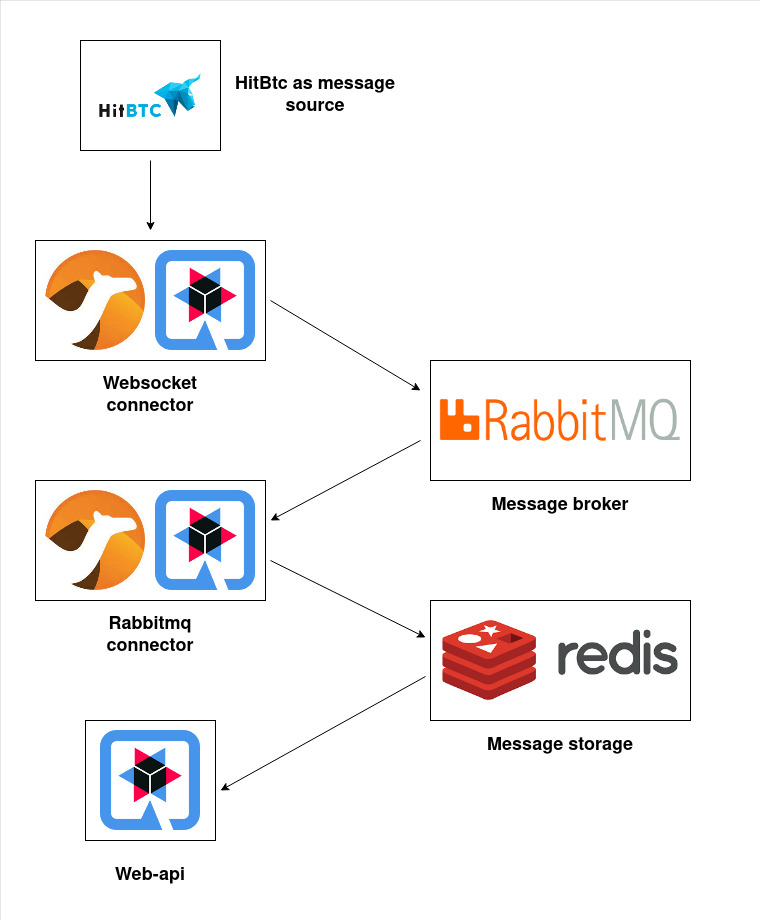

# Camel with Quarkus

---

This project was used for practicing and playing with Enterprise integration patterns,  implemented by Apache Camel and Quarkus. The HitBtc websocket api was used as a dynamic and  abundant messaging source. The system consists of:
* Websocket-connector – connect to message source and transfer messages to message broker
* Rabbitmq-connector – fetch messages from the broker, transform them, send to *in-memory database*
* Web-api – REST api for communication with web clients



---

## Building and running the project

### Prerequisites:
* maven - version 3.8.4
* docker - version 20
* java - version 17

Build :
```shell script
./build.sh
```

Start:
```shell script
./start.sh
```

Stop:
```shell script
./stop.sh
```

Get the result from Web-api:
```shell script
curl 'localhost:8080/quote/BTC-ADA'
```

The response is json, similar to:
```json
{
    "pair": "BTC-ADA",
    "side": "bid",
    "quote": 0.000016549,
    "timestamp": 1676112231708
}
```

---

Useful links:

* https://camel.apache.org/components/3.20.x/
* https://camel.apache.org/camel-quarkus/2.16.x/reference/index.html
* http://www.mastertheboss.com/soa-cloud/quarkus/how-to-use-camel-extensions-in-quarkus-applications/
* https://zinebbendhiba.com/camel-quarkus/getting-started-with-camel-quarkus-01/
